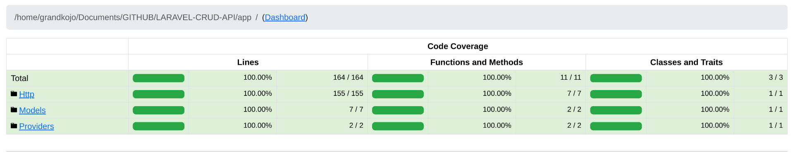

# Laravel CRUD API

This API is built using **Laravel** for managing **todos**. It allows you to perform basic CRUD operations on todo items. Please note that there is **no user authentication** in this version of the API.

---

## Features

The API supports the following operations:

1. **Get Todos**  
   Retrieve all todo items.
   
2. **Filter Todos by Status**  
   Filter todos based on their status:
   - `0`: Not Started
   - `1`: In Progress
   - `2`: Finished

3. **Order Todos**  
   Order the todo items in either ascending or descending order based on the creation date.

4. **Search for Todos**  
   Search for todos by their title or details.

5. **Create New Todos**  
   Add new todo items with a title, details, and status.

6. **Edit Existing Todos**  
   Modify the title, details, or status of an existing todo.

7. **Delete Existing Todos**  
   Remove a todo item from the list.

---

## API Endpoints

| Method  | Endpoint                    | Description                                            |
|---------|-----------------------------|--------------------------------------------------------|
| `GET`   | `/api/todos`                | Get all todos                                          |
| `GET`   | `/api/todos/{status}`       | Get todos filtered by status (0, 1, 2)                 |
| `GET`   | `/api/todos?order={asc/desc}`| Get todos ordered by creation date (ascending/descending)|
| `GET`   | `/api/todos?search={term}`  | Search todos by title or details                       |
| `POST`  | `/api/todos/new`                | Create a new todo                                      |
| `PUT`   | `/api/todos/edit/{id}`           | Update an existing todo by ID                          |
| `DELETE`| `/api/todos/delete/{id}`           | Delete a todo by ID                                    |

---

## Installation

**To get started with this API:**

The api has been hosted along side with it's documentation on a free tier Railway app.

API - https://laravel-crud-api-production-223e.up.railway.app/
API docs - https://laravel-crud-api-production-223e.up.railway.app/docs


**In case my free trial end and you want to access it**

1. **Clone the repository**:
   ```bash
   git clone https://github.com/your-username/laravel-crud-api.git
   ```

2. **Install dependencies**:
   ```bash
   cd laravel-crud-api
   composer install
   ```

3. **Set up environment variables**:
   Copy `.env.example` to `.env` and configure your environment:
   ```bash
   cp .env.example .env
   ```

4. **Generate application key**:
   ```bash
   php artisan key:generate
   ```

5. **Migrate the database**:
   ```bash
   php artisan migrate
   ```

6. **Start the development server**:
   ```bash
   php artisan serve --port=8080
   ```

Your API should now be running on `http://localhost:8080`.

---

## Test Coverage

The following is an analysis of the code coverage from xdebug and php code coverage:

- **Classes**: 10%% coverage
- **Methods**: 100%% coverage
- **Lines**: 100%% coverage




---

## License

This project is open-source and available under the [MIT License](LICENSE).